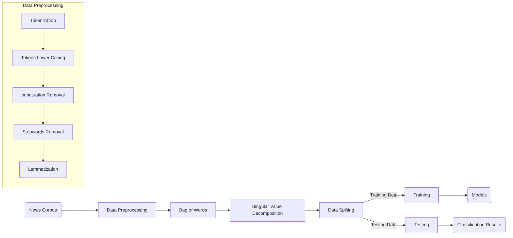

# Fake News Classification


The spreading of fake news among people is not new and it has already been reported since ancient ages. However, during the era of the internet and social media, the spreading of fake news became serious threat. Such false information should be detected as soon as possible with great accuracy to cut the negative impact on the readers. In this repository, the fake news is classified from the real news with the help of Natural Language Processing (NLP) techniques and machine learning algorithms. Moreover, machine learning’s well-known algorithms I.e. Support Vector Machine (SVM), Random Forest (RF), Naïve Bayes (NB), Logistic Regression (LR) is compared along with the custom ensemble algorithms i.e. Voting Classifier (VC) and Stacking Classifier (SC). The easy-to-use web-based interface is also proposed to classify the news on the go. The classification algorithms show the promising results on the classification of fake news from the real news. However, the SC performed exceptionally well as compare to all other algorithms in the list.

### Installation
To install the python packages, run the following command in the terminal

```shell 
pip install -r requirements
```

download the pre-trained models from the following link and place it in the models folder

[Fake news classification pre-trained models](https://univr-my.sharepoint.com/:u:/g/personal/uzairhassan_khan_studenti_univr_it/ERLJqpv32CxGk-FmOcymRyABopKIzgAFbOmErDvL2ToY4A?e=478WS0 "Fake news classification pre-trained models")

### Running The Project
To run the project there are two approaches i.e. Command Line and web-based interface

#### 1. Command Line
To classify fake news straigt from the terminal, run the following command in the terminal

```shell
python NLP/pipeline.py <Fake News Text> < sc | vc | lr | rf | svm >
```

#### 2. Interface
To start the web-based interface, use the following command in the terminal

```shell
python app.py
```

after running the command, enter the following address to your address bar

[http://127.0.0.1:8050](http://127.0.0.1:8050)

#### Classification Algorithms Performance

| Models  | Accuracy | Precision | Recall | F1-Score
| ------------ | ------------ | ------------ | ------------ | ------------ |
| Naïve Bayes  | 60%  | 60%  | 52%  | 59%  |
|   Logistic Regression | 91%  | 91%  | 91%  | 91%  |
|  Random Forest | 92%  | 92%  | 92%  | 92%  |
|  SVM |  92%  | 92%  | 92%  | 92%  |
| Voting Classifier  | 93%  | 92%  | 93%  | 92%  |
|  Stacking Classifier | 93%  | 93%  | 93%  | 93%  |


## UML diagrams


